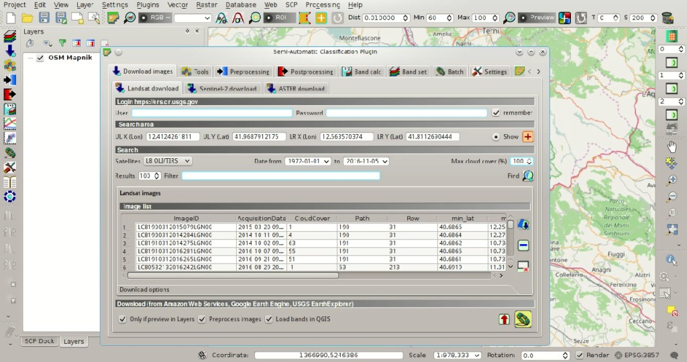
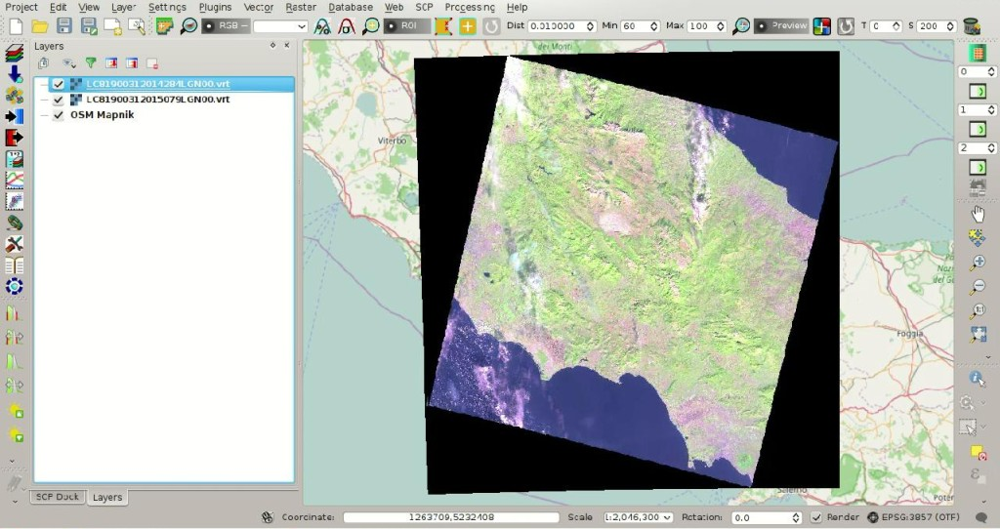
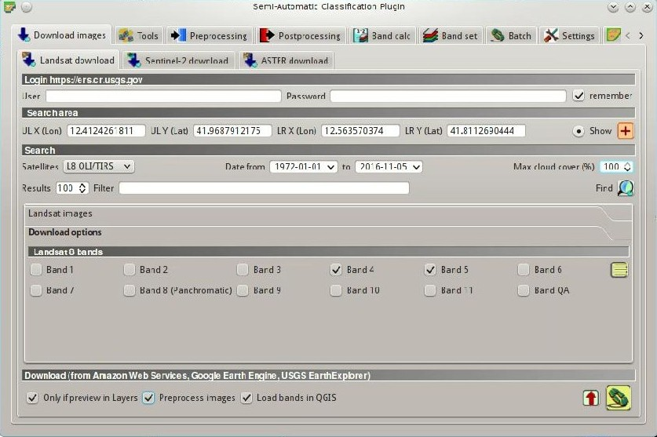
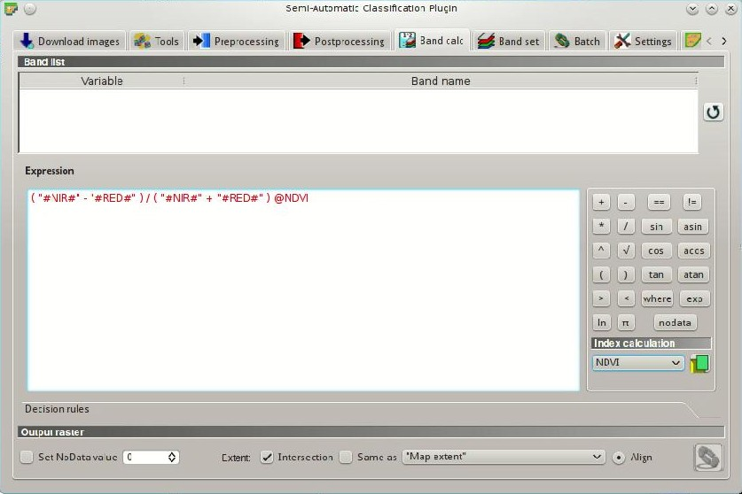
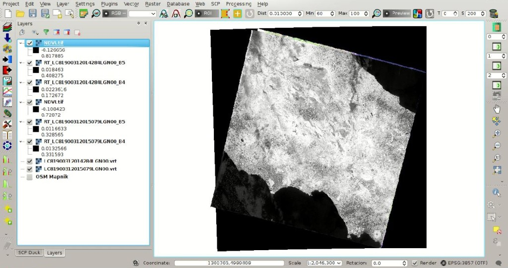
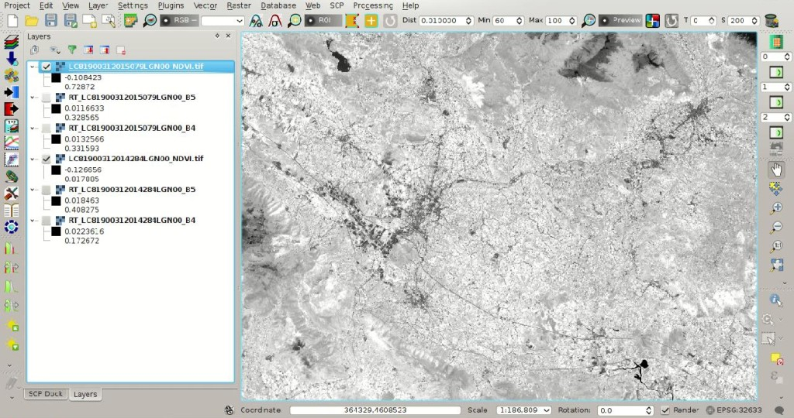
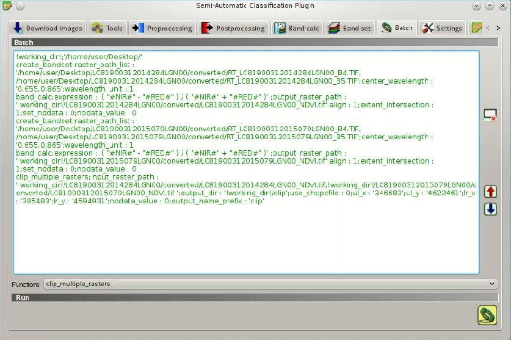
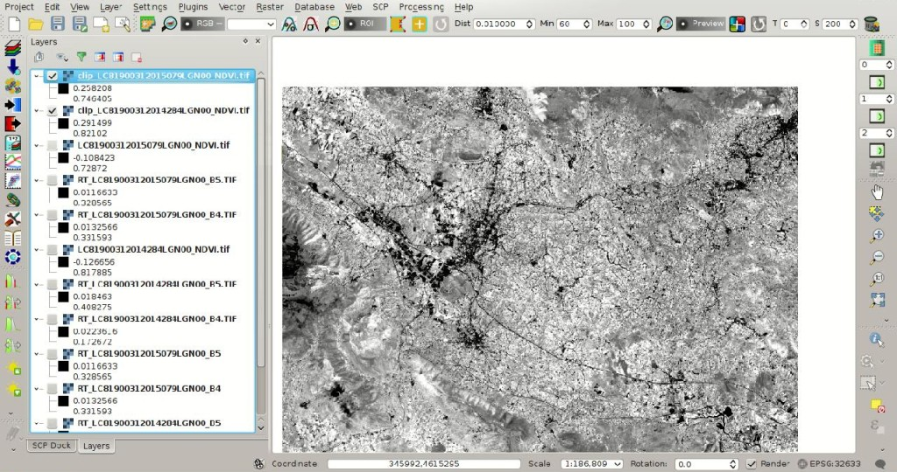

.. _thematic_tutorial_download_ndvi:

***************************************************************************
Tutorial: From Image Download to NDVI Calculation in One Move
***************************************************************************

.. |br| raw:: html

  

.. |add| image:: _static/semiautomaticclassificationplugin_add.png
	:width: 20pt
	
.. |checkbox| image:: _static/checkbox.png
	:width: 18pt
	
.. |pointer| image:: _static/semiautomaticclassificationplugin_pointer_tool.png
	:width: 20pt
	
.. |radiobutton| image:: _static/radiobutton.png
	:width: 18pt
	
.. |reload| image:: _static/semiautomaticclassificationplugin_reload.png
	:width: 20pt
	
.. |reset| image:: _static/semiautomaticclassificationplugin_reset.png
	:width: 20pt
	
.. |remove| image:: _static/semiautomaticclassificationplugin_remove.png
	:width: 20pt
	
.. |run| image:: _static/semiautomaticclassificationplugin_run.png
	:width: 24pt
	
.. |open_file| image:: _static/semiautomaticclassificationplugin_open_file.png
	:width: 20pt
	
.. |new_file| image:: _static/semiautomaticclassificationplugin_new_file.png
	:width: 20pt
	
.. |open_dir| image:: _static/semiautomaticclassificationplugin_open_dir.png
	:width: 20pt
	
.. |select_all| image:: _static/semiautomaticclassificationplugin_select_all.png
	:width: 20pt
	
.. |move_up| image:: _static/semiautomaticclassificationplugin_move_up.png
	:width: 20pt
	
.. |move_down| image:: _static/semiautomaticclassificationplugin_move_down.png
	:width: 20pt
	
.. |search_images| image:: _static/semiautomaticclassificationplugin_search_images.png
	:width: 20pt

.. |image_preview| image:: _static/semiautomaticclassificationplugin_download_image_preview.png
	:width: 20pt

.. |import| image:: _static/semiautomaticclassificationplugin_import.png
	:width: 20pt
	
.. |export| image:: _static/semiautomaticclassificationplugin_export.png
	:width: 20pt

.. |plus| image:: _static/semiautomaticclassificationplugin_plus.png
	:width: 20pt

.. |order_by_name| image:: _static/semiautomaticclassificationplugin_order_by_name.png
	:width: 20pt

.. |sign_edit_range| image:: _static/semiautomaticclassificationplugin_sign_edit_range.png
	:width: 20pt
	
.. |image_overview| image:: _static/semiautomaticclassificationplugin_download_image_overview.png
	:width: 20pt
	
.. |enter| image:: _static/semiautomaticclassificationplugin_enter.png
	:width: 20pt

.. |download| image:: _static/semiautomaticclassificationplugin_download_arrow.png
	:width: 20pt
	
.. |landsat_download| image:: _static/semiautomaticclassificationplugin_landsat8_download_tool.png
	:width: 20pt

.. |sentinel_download| image:: _static/semiautomaticclassificationplugin_sentinel_download_tool.png
	:width: 20pt
	
.. |tools| image:: _static/semiautomaticclassificationplugin_roi_tool.png
	:width: 20pt
	
.. |roi_multiple| image:: _static/semiautomaticclassificationplugin_roi_multiple.png
	:width: 20pt

.. |import_spectral_library| image:: _static/semiautomaticclassificationplugin_import_spectral_library.png
	:width: 20pt
	
.. |export_spectral_library| image:: _static/semiautomaticclassificationplugin_export_spectral_library.png
	:width: 20pt
	
.. |weight_tool| image:: _static/semiautomaticclassificationplugin_weight_tool.png
	:width: 20pt
	
.. |threshold_tool| image:: _static/semiautomaticclassificationplugin_threshold_tool.png
	:width: 20pt
	
.. |LCS_threshold| image:: _static/semiautomaticclassificationplugin_LCS_threshold_tool.png
	:width: 20pt
	
.. |LCS_threshold_set_tool| image:: _static/semiautomaticclassificationplugin_LCS_threshold_set_tool.png
	:width: 20pt
	
.. |preprocessing| image:: _static/semiautomaticclassificationplugin_class_tool.png
	:width: 20pt
	
.. |landsat_tool| image:: _static/semiautomaticclassificationplugin_landsat8_tool.png
	:width: 20pt
	
.. |sentinel2_tool| image:: _static/semiautomaticclassificationplugin_sentinel_tool.png
	:width: 20pt
	
.. |aster_tool| image:: _static/semiautomaticclassificationplugin_aster_tool.png
	:width: 20pt
	
.. |split_raster| image:: _static/semiautomaticclassificationplugin_split_raster.png
	:width: 20pt
	
.. |clip_tool| image:: _static/semiautomaticclassificationplugin_clip_tool.png
	:width: 20pt
	
.. |pca_tool| image:: _static/semiautomaticclassificationplugin_pca_tool.png
	:width: 20pt
	
.. |vector_to_raster_tool| image:: _static/semiautomaticclassificationplugin_vector_to_raster_tool.png
	:width: 20pt
	
.. |post_process| image:: _static/semiautomaticclassificationplugin_post_process.png
	:width: 20pt
	
.. |accuracy_tool| image:: _static/semiautomaticclassificationplugin_accuracy_tool.png
	:width: 20pt
	
.. |land_cover_change| image:: _static/semiautomaticclassificationplugin_land_cover_change.png
	:width: 20pt
	
.. |report_tool| image:: _static/semiautomaticclassificationplugin_report_tool.png
	:width: 20pt

.. |class_to_vector_tool| image:: _static/semiautomaticclassificationplugin_class_to_vector_tool.png
	:width: 20pt

.. |reclassification_tool| image:: _static/semiautomaticclassificationplugin_reclassification_tool.png
	:width: 20pt

.. |edit_raster| image:: _static/semiautomaticclassificationplugin_edit_raster.png
	:width: 20pt

.. |undo_edit_raster| image:: _static/semiautomaticclassificationplugin_undo_edit_raster.png
	:width: 20pt

.. |classification_sieve| image:: _static/semiautomaticclassificationplugin_classification_sieve.png
	:width: 20pt

.. |classification_erosion| image:: _static/semiautomaticclassificationplugin_classification_erosion.png
	:width: 20pt

.. |classification_dilation| image:: _static/semiautomaticclassificationplugin_classification_dilation.png
	:width: 20pt

.. |bandcalc_tool| image:: _static/semiautomaticclassificationplugin_bandcalc_tool.png
	:width: 20pt
	
.. |batch_tool| image:: _static/semiautomaticclassificationplugin_batch.png
	:width: 20pt

.. |bandset_tool| image:: _static/semiautomaticclassificationplugin_bandset_tool.png
	:width: 20pt
	
.. |settings_tool| image:: _static/semiautomaticclassificationplugin_settings_tool.png
	:width: 20pt
	
.. |manual_ROI| image:: _static/semiautomaticclassificationplugin_manual_ROI.png
	:width: 20pt

.. |save_roi| image:: _static/semiautomaticclassificationplugin_save_roi.png
	:width: 20pt
	
.. |roi_single| image:: _static/semiautomaticclassificationplugin_roi_single.png
	:width: 20pt
	
.. |roi_redo| image:: _static/semiautomaticclassificationplugin_roi_redo.png
	:width: 20pt

.. |preview| image:: _static/semiautomaticclassificationplugin_preview.png
	:width: 20pt
	
.. |preview_redo| image:: _static/semiautomaticclassificationplugin_preview_redo.png
	:width: 20pt
	
.. |delete_signature| image:: _static/semiautomaticclassificationplugin_delete_signature.png
	:width: 20pt

.. |sign_plot| image:: _static/semiautomaticclassificationplugin_sign_tool.png
	:width: 20pt

.. |cumulative_stretch| image:: _static/semiautomaticclassificationplugin_bandset_cumulative_stretch_tool.png
	:width: 20pt

.. |std_dev_stretch| image:: _static/semiautomaticclassificationplugin_bandset_std_dev_stretch_tool.png
	:width: 20pt

.. |calculate_spectral_distances| image:: _static/semiautomaticclassificationplugin_calculate_spectral_distances.png
	:width: 20pt
	
.. |LCS_threshold_ROI_tool| image:: _static/semiautomaticclassificationplugin_LCS_threshold_ROI_tool.png
	:width: 20pt
	
.. contents::
    :depth: 2
    :local:
	
This tutorial describes the easy steps for downloading multiple satellite images (:ref:`download_tab`), converting the DN values to reflectance, and automatically calculate NDVI (i.e. Normalized Difference Vegetation Index).

In particular, the :guilabel:`SCP` tools are intertwined through options in the plugin interface, allowing for the definition of a workflow.
The same phases of this tutorial can be adapted to automatically calculate any spectral index for several satellite images.
Finally, some of the :ref:`batch_tab` tools are illustrated, which allow for the processing of already downloaded images.

Following the video of this tutorial.

.. raw:: html

	<iframe allowfullscreen="" frameborder="0" height="360" src="http://www.youtube.com/embed/7W4IwlvPLbQ?rel=0" width="100%"></iframe>

http://www.youtube.com/watch?v=7W4IwlvPLbQ

.. _tutorial_download_ndvi_search_data:

Search the Images
---------------------------------

First we need to search and select the satellite images to be downloaded and automatically processed.
For more details about Sentinel-2 and Landsat images see :ref:`tutorial_2_data_download` and :ref:`tutorial_temperature_download_data`.

In this tutorial we are going to use Landsat 8 images (data available from the U.S. Geological Survey), but of course the same method can be applied to Sentinel-2 or ASTER images.

Start a new QGIS project.
Open the tab :ref:`download_tab` clicking the button |download| in the :ref:`SCP_menu`, or the :ref:`toolbar_tools`, or the :ref:`SCP_dock`.
Select the tab :ref:`Landsat_download_tab`.

In :ref:`login_Landsat` you should enter the user name and password for accessing data (`free registration at USGS EROS is required <https://ers.cr.usgs.gov/register>`_) in :guilabel:`User` and :guilabel:`Password`.
Landsat 8 images are largely available for download from the `Amazon Web Services (AWS) <http://aws.amazon.com/public-data-sets/landsat/>`_ that does not require to login.

In :ref:`search_area_Landsat` click the button |pointer| and draw a rectangle in the map to define the area coordinates.

Now click the button :guilabel:`Find` |search_images| and after a few seconds the image will be listed in the ``Image list``.

	
	:guilabel:`Landsat search result`
	
In the result table, click some of the items and click the button |image_preview|.
A preview for each image will be downloaded and displayed in the map, which is useful for assessing the quality of the image and the cloud cover.
Remove the previews to be excluded from download, and leave loaded in QGIS only the images that we want to process.

	
	:guilabel:`Image previews`
	
.. _tutorial_download_ndvi_download_process_data:

Download and Process Data
---------------------------------

Now we can define the settings of the tools used for download and processing.
It is worth noticing the options that link one tool to the following one, from the download, to the processing, to the :guilabel:`Band set` creation, and to the NDVI calculation.

Click the tab :ref:`landsat_download_options` and check only bands 4 (Red) and 5 (Near Infrared) (NDVI calculation requires Red and Near Infrared bands, therefore we are going to download only these two bands).
Also, leave checked the options |checkbox| :guilabel:`Only if preview in Layers` and |checkbox| :guilabel:`Preprocess images` (this is the link to the tool :ref:`landsat_tab`).

	
	:guilabel:`Download settings`
	
Now we define the options for the conversion to reflectance.
Open the tab :ref:`landsat_tab`, check |checkbox| :guilabel:`Apply DOS1 atmospheric correction` and |checkbox| :guilabel:`Create Band set and use Band set tools` (this is the link to the tool :ref:`band_set_tab` allowing for the creation of a :guilabel:`Band set` for every image).
	
.. figure:: _static/tutorial_download_ndvi/tutorial_download_ndvi_2_2.jpg
	:align: center
	
	:guilabel:`Preprocessing settings`
	
Open the tab :ref:`band_set_tab` clicking the button |bandset_tool| in the :ref:`SCP_menu`, or the :ref:`toolbar_tools`, or the :ref:`SCP_dock`.
Check |checkbox| :guilabel:`Band calc expression`, which is the link to the tool :ref:`band_calc_tab`.
	
.. figure:: _static/tutorial_download_ndvi/tutorial_download_ndvi_2_3.jpg
	:align: center
	
	:guilabel:`Band set settings`
	
Now we can define the expression used for calculation based on the :guilabel:`Band set`.
Open the tab |bandcalc_tool| :ref:`band_calc_tab`, in :ref:`index_calculation` select :guilabel:`NDVI`, which enters the following :ref:`expression`::

	(( "#NIR#" - "#RED#") / ( "#NIR#" + "#RED#") @NDVI)

The "#NIR#" (Near Infrared) and "#RED#" bands are automatically identified from the :guilabel:`Band set`.
	

	
	:guilabel:`Band calc settings`
	
In order to start the **download and conversion process**, open the tab :ref:`Landsat_download_tab`, click the button |run| and select the directory where converted bands are saved (e.g. ``Desktop``).
After a few minutes, converted bands are loaded and displayed (file name starts with ``RT_``).
Also, the NDVI calculation is performed for all the downloaded images and a file ``NDVI.tif`` saved in the same directory of converted images.

	
	:guilabel:`NDVI calculation`
	
.. _tutorial_download_ndvi_batch_conversion:

Batch Data Processing
---------------------------------

In case we have previously downloaded images, we can use the :ref:`batch_tab` functions to automatically perform the preprocessing, to the :guilabel:`Band set` creation, and to the NDVI calculation.

Open the tab :ref:`batch_tab` and select ``!working_dir!`` in :guilabel:`Functions`, which is the list of all available functions.

The text ``!working_dir!;''`` is added to the text, which is the working directory; after the semicolon (following the name of the function) enter the path to the image directory such as::

	!working_dir!;'!working_dir!;'/home/user/Desktop/'
	
The ``!working_dir!`` is used in the following functions where the relative path to the images is entered.

In :guilabel:`Functions` click ``landsat_conversion`` to enter all the options of the tool :ref:`landsat_tab`. After ``input_dir :`` enter the path to the image directory inside ``' '``; after ``apply_dos1 :`` enter ``1`` to apply the DOS1 correction (for checkboxes, value 1 means checked and value 0 means unchecked); after ``output_dir :`` enter the output directory for converted bands (not existing directory is automatically created), such as::

	landsat_conversion;input_dir : '!working_dir!LC81900312014284LGN00/';mtl_file_path : '';celsius_temperature : 0;apply_dos1 : 1;use_nodata : 1;nodata_value : 0;pansharpening : 0;create_bandset : 1;output_dir : '!working_dir!/LC81900312014284LGN00/converted'

The folder ``converted`` is created inside the ``!working_dir!``.
The option ``create_bandset : 1`` creates the :guilabel:`Band set` required for the calculation.

In :guilabel:`Functions` click ``band_calc``; after `expression :` enter ``( "#NIR#" - "#RED#" ) / ( "#NIR#" + "#RED#" )``; after ``output_raster_path :`!working_dir!/LC81900312014284LGN00/converted/NDVI.tif`; remove entirely the option ``extent_same_as_raster_name : '';`` such as::

	band_calc;expression : '( "#NIR#" - "#RED#" ) / ( "#NIR#" + "#RED#" )';output_raster_path : '!working_dir!/LC81900312014284LGN00/converted/LC81900312014284LGN00_NDVI.tif';align : 1;extent_intersection : 1;set_nodata : 0;nodata_value : 0

We can enter the same functions of conversion and calculation for other images.
When the expression is green we can run the batch tool clicking the button |run|.

.. figure:: _static/tutorial_download_ndvi/tutorial_download_ndvi_3_1.jpg
	:align: center
	
	:guilabel:`Batch expression`
	
After the calculation the converted bands and NDVI rasters are displayed in the map.
	

	
	:guilabel:`NDVI rasters`
	
.. _tutorial_download_ndvi_batch_calculation:

Batch Data Calculation
---------------------------------

In case we already have converted the images, and we only need to perform the NDVI calculation, we can use the following function for creating the :guilabel:`Band set` (remove entirely the options ``;multiplicative_factor : '';additive_factor : ''``)::

	create_bandset;raster_path_list : '/home/user/Desktop/LC81900312014284LGN00/converted/RT_LC81900312014284LGN00_B4.TIF, /home/user/Desktop/LC81900312014284LGN00/converted/RT_LC81900312014284LGN00_B5.TIF';center_wavelength : '0.655,0.865';wavelength_unit : 1

The option ``raster_path_list`` is the list of paths to image bands (separated by ``,``).
The option ``center_wavelength`` is required for the automatic identification of bands ``"#NIR#"`` and ``"#RED#"``.
Now we can copy the same command used before for the NDVI calculation::

	band_calc;expression : '( "#NIR#" - "#RED#" ) / ( "#NIR#" + "#RED#" )';output_raster_path : '!working_dir!/LC81900312014284LGN00/converted/LC81900312014284LGN00_NDVI.tif';align : 1;extent_intersection : 1;set_nodata : 0;nodata_value : 0

We can copy the same functions of :guilabel:`Band set` creation and calculation for other images.
Finally, we could also clip the resulting NDVI rasters using upper left and lower right coordinates (identified in the map), adding the following function (remove entirely the options ``use_shapefile : 0;shapefile_path : '';``)::

	clip_multiple_rasters;input_raster_path : '!working_dir!/LC81900312014284LGN00/converted/LC81900312014284LGN00_NDVI.tif,!working_dir!/LC81900312015079LGN00/converted/LC81900312015079LGN00_NDVI.tif ';output_dir : '!working_dir!/clip';use_shapefile : 0;ul_x : '346683';ul_y : '4622461';lr_x : '385483';lr_y : '4594931';nodata_value : 0;output_name_prefix : 'clip'
	
When the expression is green we can run the batch tool clicking the button |run|.

	
	:guilabel:`Batch expression`
	
After the calculation the clipped NDVI rasters are displayed in the map.

	
	:guilabel:`NDVI clipped rasters`
	
According to our needs, we can add other :ref:`batch_tab` functions and create an automatic workflow.
