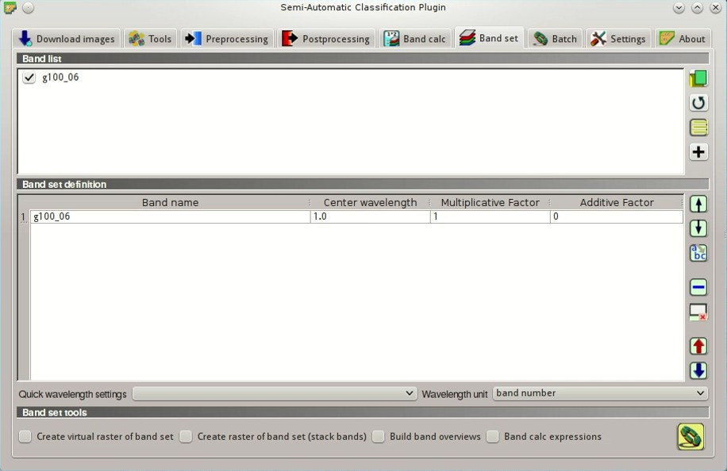
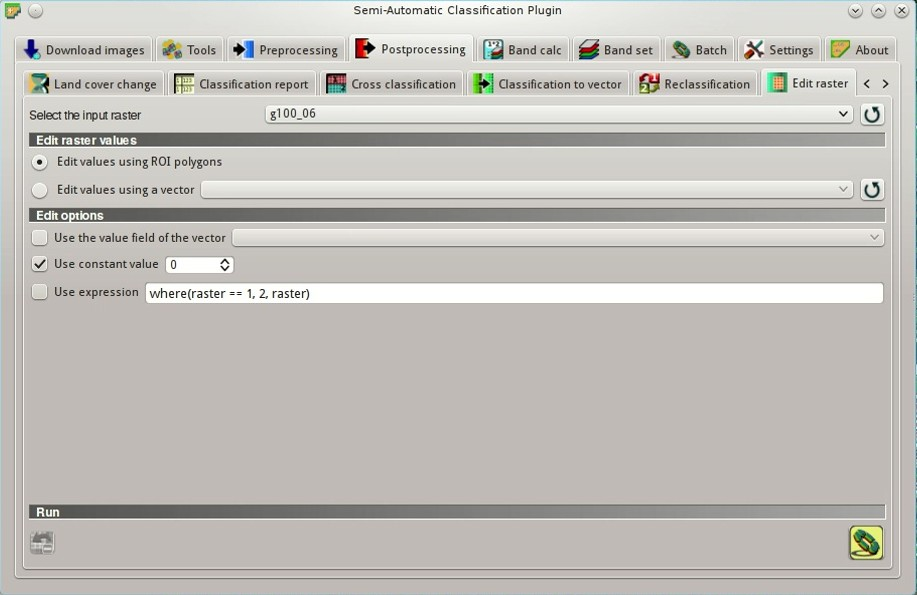
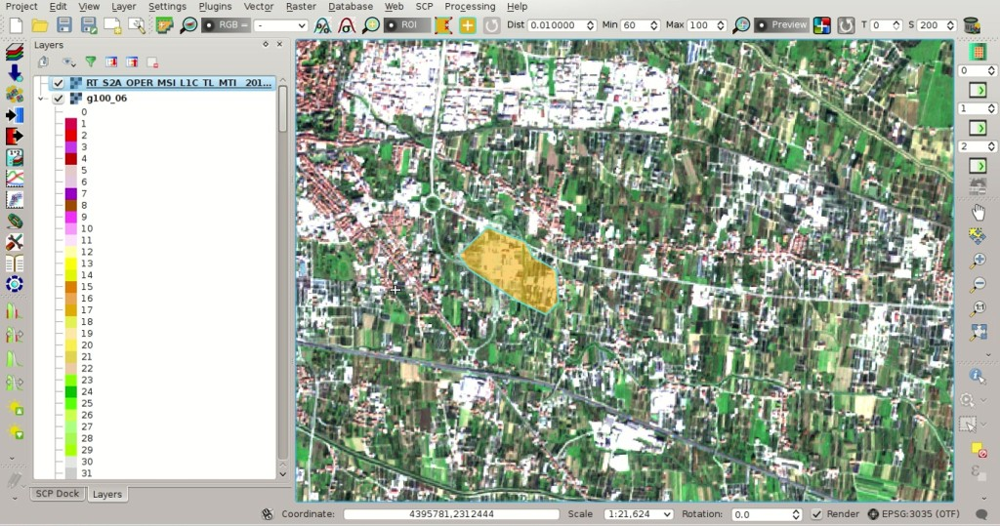
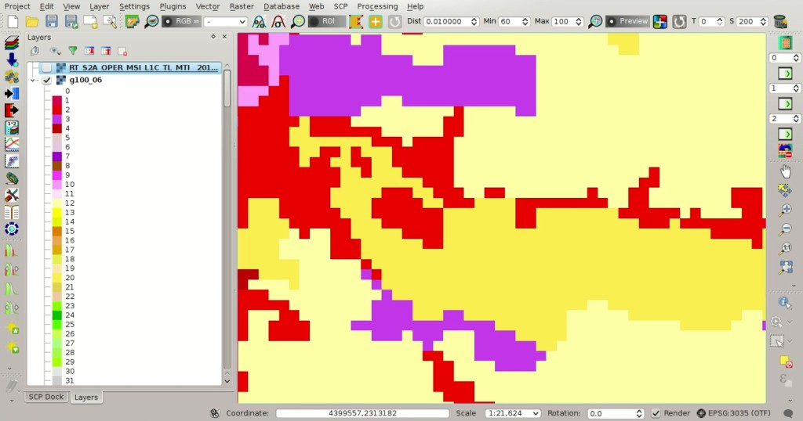
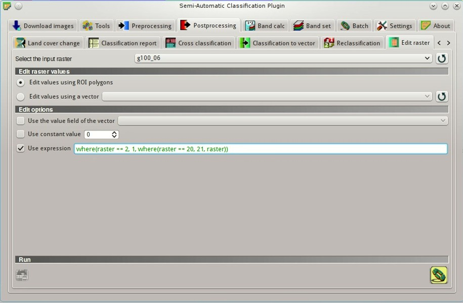
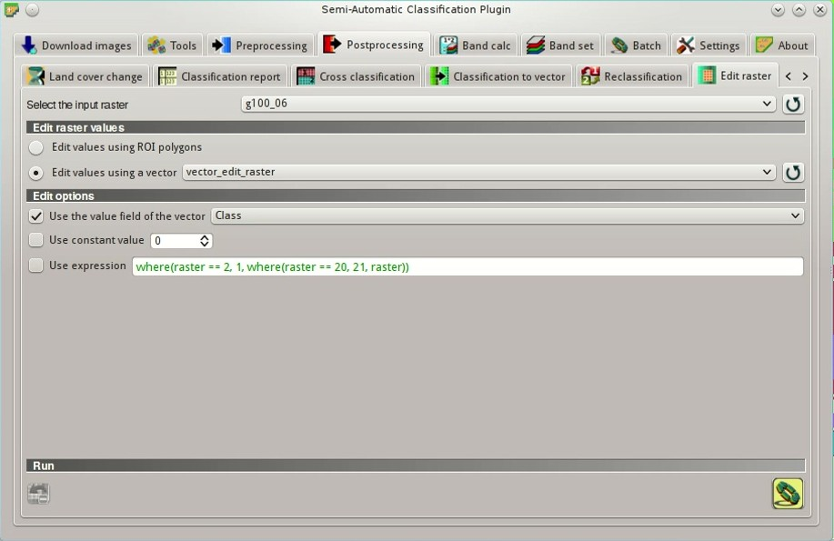

.. _thematic_tutorial_edit_raster:

***************************************************************************
Tutorial: Direct Editing of a Raster
***************************************************************************

.. |br| raw:: html

  

.. |input_list| image:: _static/input_list.jpg
	:width: 20pt
	
.. |input_number| image:: _static/input_number.jpg
	:width: 20pt
	
.. |add| image:: _static/semiautomaticclassificationplugin_add.png
	:width: 20pt
	
.. |checkbox| image:: _static/checkbox.png
	:width: 18pt
	
.. |pointer| image:: _static/semiautomaticclassificationplugin_pointer_tool.png
	:width: 20pt
	
.. |radiobutton| image:: _static/radiobutton.png
	:width: 18pt
	
.. |reload| image:: _static/semiautomaticclassificationplugin_reload.png
	:width: 20pt
	
.. |reset| image:: _static/semiautomaticclassificationplugin_reset.png
	:width: 20pt
	
.. |remove| image:: _static/semiautomaticclassificationplugin_remove.png
	:width: 20pt
	
.. |run| image:: _static/semiautomaticclassificationplugin_run.png
	:width: 24pt
	
.. |open_file| image:: _static/semiautomaticclassificationplugin_open_file.png
	:width: 20pt
	
.. |new_file| image:: _static/semiautomaticclassificationplugin_new_file.png
	:width: 20pt
	
.. |open_dir| image:: _static/semiautomaticclassificationplugin_open_dir.png
	:width: 20pt
	
.. |select_all| image:: _static/semiautomaticclassificationplugin_select_all.png
	:width: 20pt
	
.. |move_up| image:: _static/semiautomaticclassificationplugin_move_up.png
	:width: 20pt
	
.. |move_down| image:: _static/semiautomaticclassificationplugin_move_down.png
	:width: 20pt
	
.. |search_images| image:: _static/semiautomaticclassificationplugin_search_images.png
	:width: 20pt

.. |image_preview| image:: _static/semiautomaticclassificationplugin_download_image_preview.png
	:width: 20pt

.. |import| image:: _static/semiautomaticclassificationplugin_import.png
	:width: 20pt
	
.. |export| image:: _static/semiautomaticclassificationplugin_export.png
	:width: 20pt

.. |plus| image:: _static/semiautomaticclassificationplugin_plus.png
	:width: 20pt

.. |order_by_name| image:: _static/semiautomaticclassificationplugin_order_by_name.png
	:width: 20pt

.. |sign_edit_range| image:: _static/semiautomaticclassificationplugin_sign_edit_range.png
	:width: 20pt
	
.. |image_overview| image:: _static/semiautomaticclassificationplugin_download_image_overview.png
	:width: 20pt
	
.. |enter| image:: _static/semiautomaticclassificationplugin_enter.png
	:width: 20pt

.. |download| image:: _static/semiautomaticclassificationplugin_download_arrow.png
	:width: 20pt
	
.. |landsat_download| image:: _static/semiautomaticclassificationplugin_landsat8_download_tool.png
	:width: 20pt

.. |sentinel_download| image:: _static/semiautomaticclassificationplugin_sentinel_download_tool.png
	:width: 20pt
	
.. |tools| image:: _static/semiautomaticclassificationplugin_roi_tool.png
	:width: 20pt
	
.. |roi_multiple| image:: _static/semiautomaticclassificationplugin_roi_multiple.png
	:width: 20pt

.. |import_spectral_library| image:: _static/semiautomaticclassificationplugin_import_spectral_library.png
	:width: 20pt
	
.. |export_spectral_library| image:: _static/semiautomaticclassificationplugin_export_spectral_library.png
	:width: 20pt
	
.. |weight_tool| image:: _static/semiautomaticclassificationplugin_weight_tool.png
	:width: 20pt
	
.. |threshold_tool| image:: _static/semiautomaticclassificationplugin_threshold_tool.png
	:width: 20pt
	
.. |LCS_threshold| image:: _static/semiautomaticclassificationplugin_LCS_threshold_tool.png
	:width: 20pt
	
.. |LCS_threshold_set_tool| image:: _static/semiautomaticclassificationplugin_LCS_threshold_set_tool.png
	:width: 20pt
	
.. |preprocessing| image:: _static/semiautomaticclassificationplugin_class_tool.png
	:width: 20pt
	
.. |landsat_tool| image:: _static/semiautomaticclassificationplugin_landsat8_tool.png
	:width: 20pt
	
.. |sentinel2_tool| image:: _static/semiautomaticclassificationplugin_sentinel_tool.png
	:width: 20pt
	
.. |aster_tool| image:: _static/semiautomaticclassificationplugin_aster_tool.png
	:width: 20pt
	
.. |split_raster| image:: _static/semiautomaticclassificationplugin_split_raster.png
	:width: 20pt
	
.. |clip_tool| image:: _static/semiautomaticclassificationplugin_clip_tool.png
	:width: 20pt
	
.. |pca_tool| image:: _static/semiautomaticclassificationplugin_pca_tool.png
	:width: 20pt
	
.. |vector_to_raster_tool| image:: _static/semiautomaticclassificationplugin_vector_to_raster_tool.png
	:width: 20pt
	
.. |post_process| image:: _static/semiautomaticclassificationplugin_post_process.png
	:width: 20pt
	
.. |accuracy_tool| image:: _static/semiautomaticclassificationplugin_accuracy_tool.png
	:width: 20pt
	
.. |land_cover_change| image:: _static/semiautomaticclassificationplugin_land_cover_change.png
	:width: 20pt
	
.. |report_tool| image:: _static/semiautomaticclassificationplugin_report_tool.png
	:width: 20pt

.. |class_to_vector_tool| image:: _static/semiautomaticclassificationplugin_class_to_vector_tool.png
	:width: 20pt

.. |reclassification_tool| image:: _static/semiautomaticclassificationplugin_reclassification_tool.png
	:width: 20pt

.. |edit_raster| image:: _static/semiautomaticclassificationplugin_edit_raster.png
	:width: 20pt

.. |undo_edit_raster| image:: _static/semiautomaticclassificationplugin_undo_edit_raster.png
	:width: 20pt

.. |classification_sieve| image:: _static/semiautomaticclassificationplugin_classification_sieve.png
	:width: 20pt

.. |classification_erosion| image:: _static/semiautomaticclassificationplugin_classification_erosion.png
	:width: 20pt

.. |classification_dilation| image:: _static/semiautomaticclassificationplugin_classification_dilation.png
	:width: 20pt

.. |bandcalc_tool| image:: _static/semiautomaticclassificationplugin_bandcalc_tool.png
	:width: 20pt
	
.. |batch_tool| image:: _static/semiautomaticclassificationplugin_batch.png
	:width: 20pt

.. |bandset_tool| image:: _static/semiautomaticclassificationplugin_bandset_tool.png
	:width: 20pt
	
.. |settings_tool| image:: _static/semiautomaticclassificationplugin_settings_tool.png
	:width: 20pt
	
.. |manual_ROI| image:: _static/semiautomaticclassificationplugin_manual_ROI.png
	:width: 20pt

.. |save_roi| image:: _static/semiautomaticclassificationplugin_save_roi.png
	:width: 20pt
	
.. |roi_single| image:: _static/semiautomaticclassificationplugin_roi_single.png
	:width: 20pt
	
.. |roi_redo| image:: _static/semiautomaticclassificationplugin_roi_redo.png
	:width: 20pt

.. |preview| image:: _static/semiautomaticclassificationplugin_preview.png
	:width: 20pt
	
.. |preview_redo| image:: _static/semiautomaticclassificationplugin_preview_redo.png
	:width: 20pt
	
.. |delete_signature| image:: _static/semiautomaticclassificationplugin_delete_signature.png
	:width: 20pt

.. |sign_plot| image:: _static/semiautomaticclassificationplugin_sign_tool.png
	:width: 20pt

.. |cumulative_stretch| image:: _static/semiautomaticclassificationplugin_bandset_cumulative_stretch_tool.png
	:width: 20pt

.. |std_dev_stretch| image:: _static/semiautomaticclassificationplugin_bandset_std_dev_stretch_tool.png
	:width: 20pt

.. |calculate_spectral_distances| image:: _static/semiautomaticclassificationplugin_calculate_spectral_distances.png
	:width: 20pt
	
.. |LCS_threshold_ROI_tool| image:: _static/semiautomaticclassificationplugin_LCS_threshold_ROI_tool.png
	:width: 20pt
	
.. contents::
    :depth: 2
    :local:
	
This tutorial describes the :guilabel:`SCP` tool :ref:`edit_raster_tab` that allows for the direct editing of pixel values in a raster.
Direct editing is very convenient in case of large rasters, reducing the computational time and easing the process of updating a raster such as land cover classification.

In this tutorial we are going to edit a very large raster, which is the **Corine Land Cover** referred to year 2006 (but it is available also for 1990, 2000 and 2012).
This raster is produced by the European Environment Agency (EEA), and covers the whole European Countries with a spatial resolution of 100m and a very detailed classification system.
For more information read `this page <http://land.copernicus.eu/pan-european/corine-land-cover>`_ .

First, **download the raster data** from this link `Corine Land Cover 2006 (Version 17) <http://www.eea.europa.eu/data-and-maps/data/clc-2006-raster-3/clc-2006-100m/g100_06.zip/at_download/file>`_ provided for free by the `EEA <http://www.eea.europa.eu/data-and-maps/data/clc-2006-raster-3#tab-metadata>`_ .

Following the video of this tutorial.

.. raw:: html

	<iframe allowfullscreen="" frameborder="0" height="360" src="http://www.youtube.com/embed/7W4IwlvPLbQ?rel=0" width="100%"></iframe>

http://www.youtube.com/watch?v=7W4IwlvPLbQ

.. _tutorial_edit_raster_ROI:

Edit Raster Using ROI Polygons
---------------------------------

After the download of the Corine Land Cover, extract the archive and load the file ``g100_06.tif`` in QGIS.
The complete list of raster values corresponding to each land cover class is included in the file ``clc_legend.xls``, which was downloaded along with the raster.
For instance, value 1 corresponds to class ``Continuous urban fabric``, value 2 corresponds to class ``Discontinuous urban fabric``, value 23 corresponds to class ``Broad-leaved forest``.
We are going to update the classification by photo-interpretation and manual editing.
	
We can use a Sentinel-2 image acquired in 2016 (provided by the Copernicus `Scientific Data Hub <https://scihub.copernicus.eu/>`_) for updating the land cover classification.
See :ref:`tutorial_2_data_download` for the details about Sentinel-2 download.
Of course, other plugins such as `QuickMapServices <http://plugins.qgis.org/plugins/quick_map_services/>`_ or `OpenStreetMap <http://www.openstreetmap.org>`_) can be used for displaying high resolution images.

Now open the tab :ref:`band_set_tab` (for further instructions see :ref:`tutorial_2_band_set`) and set the raster Corine Land Cover as the only input band.
This is required for the creation of ROI polygons.

	
	:guilabel:`Band set creation`
	
Also, we need to set the raster Corine Land Cover as input for the raster editing.
Open the tab |edit_raster| :ref:`edit_raster_tab`, and set the input raster in :guilabel:`Select the input raster` |input_list| (click the button |reload| for reloading the layer list).

	
	:guilabel:`Edit raster input`

After loading a recent image in QGIS, zoom to an area where land cover changes occurred, and draw a temporary ROI (for further instructions see :ref:`tutorial_2_2`).

	
	:guilabel:`Temporary ROI polygon`

Now open the :ref:`toolbar_edit_raster`, which is designed for the manual editing of rasters.
There are three |input_number| values that can be modified according to the value that we want to apply to the raster.
Click the button |enter| beside each of these values, and the raster is updated using the selected constant value for all the pixels intersecting the temporary ROI.

	**Attention**: the input raster is directly edited; it is recommended to create a **backup copy** of the input raster before using this tool in order to prevent data loss.
	
Also, the button |undo_edit_raster| can undo the most recent editing.

	
	:guilabel:`Raster updated with the new value`

Considering that we are editing a very large raster, the new value is applied almost instantaneously.
We can repeat the ROI creation and update the raster values of other areas.

To ease the editing process, we can use conditional expressions with the structure ``where(condition, true, false)``.
In the :ref:`edit_raster_tab`, check the checkbox |checkbox| :guilabel:`Use expression` and enter a conditional expression.

The variable name ``raster`` is used for the input raster.
For instance, the expression ``where(raster == 1, 2, raster)`` will change only the pixels of class 1 intersecting the temporary ROI, while other pixels will be unchanged.
Of course we can change the expression according to our needs, always using the variable name ``raster``.
For instance the expression ``where(raster == 2, 1, where(raster == 20, 21, raster))`` will change values to 1 for pixel values equal to 2, or change the value to 21 for pixel values equal to 20.
If the expression text is green, then the structure of the expression is correct.
	

	
	:guilabel:`Edit with expression`
	
.. _tutorial_edit_raster_vector_file:

Edit Raster Using a Vector file
---------------------------------

We can use a vector file in order to change raster values for all the polygons at once.
It is possible to select a vector field containing the new values that will be applied to the raster.

Add a vector file to the QGIS project (for instance download `this shapefile <https://drive.google.com/uc?export=download&id=0BysUrKXWIDwBbVc4aHY2cVNFOUk>`_ ).
Open the tab |edit_raster| :ref:`edit_raster_tab`, check the checkbox |checkbox| :guilabel:`Edit values using a vector` and select the vector layer (click the button |reload| for reloading the layer list).
Also, check the checkbox |checkbox| :guilabel:`Use the value field of the vector` and select the attribute field containing the values to be applied to the raster (in this example the field ``Class``).

	
	:guilabel:`Vector input`

Now click the button |run| and all the changes will be applied to the raster according to polygon values.
	
	**Attention**: the input raster is directly edited; it is recommended to create a **backup copy** of the input raster before using this tool in order to prevent data loss.

This method is very rapid, especially if vector polygons have a small area (the larger are the polygons, the longer is the process).
