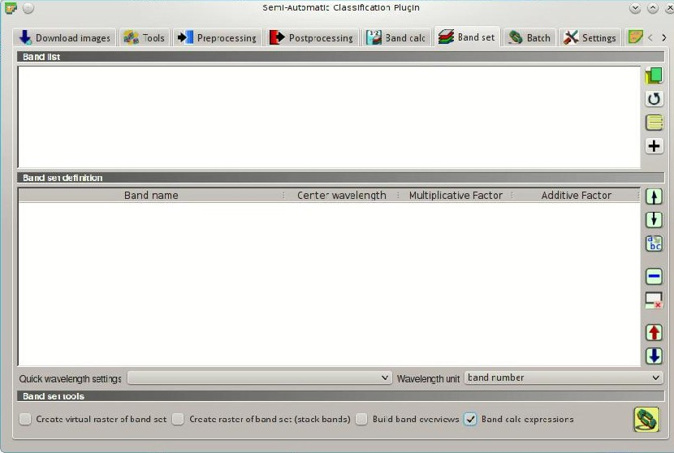
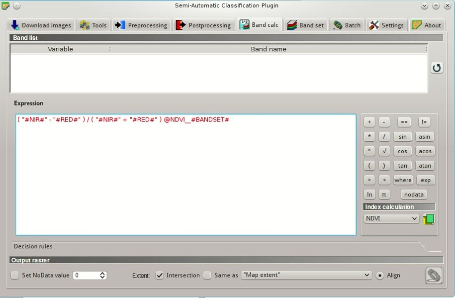
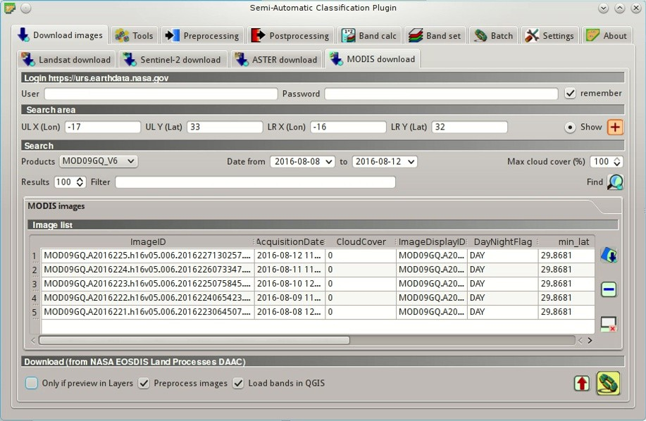
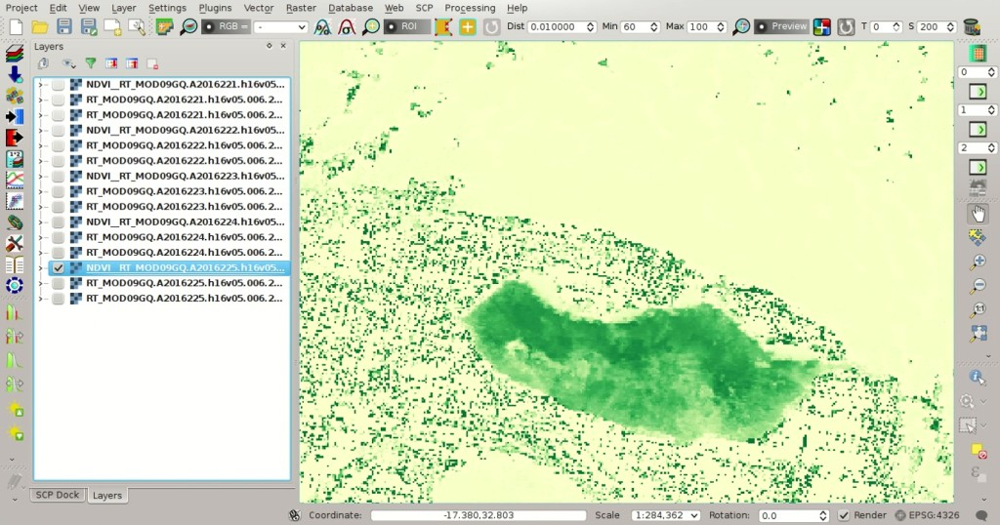
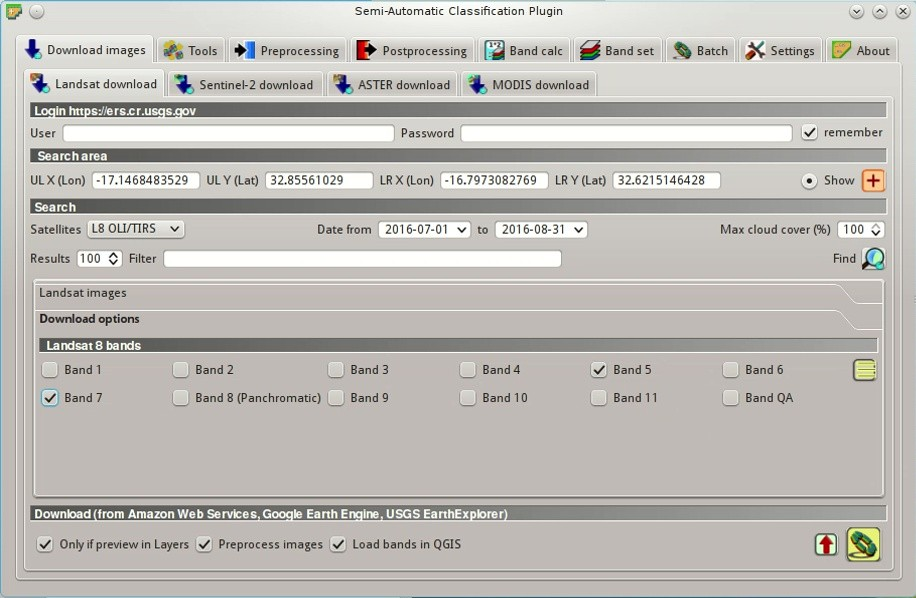
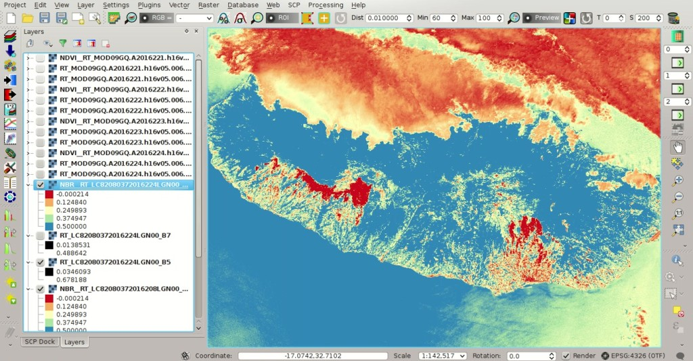
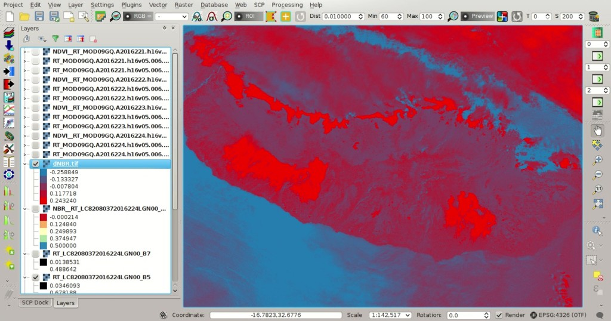

.. _thematic_tutorial_fire_monitoring:

***************************************************************************
Tutorial: Wildfire Monitoring
***************************************************************************

.. |br| raw:: html

  

.. |input_list| image:: _static/input_list.jpg
	:width: 20pt
	
.. |input_number| image:: _static/input_number.jpg
	:width: 20pt
	
.. |add| image:: _static/semiautomaticclassificationplugin_add.png
	:width: 20pt
	
.. |checkbox| image:: _static/checkbox.png
	:width: 18pt
	
.. |pointer| image:: _static/semiautomaticclassificationplugin_pointer_tool.png
	:width: 20pt
	
.. |radiobutton| image:: _static/radiobutton.png
	:width: 18pt
	
.. |reload| image:: _static/semiautomaticclassificationplugin_reload.png
	:width: 20pt
	
.. |reset| image:: _static/semiautomaticclassificationplugin_reset.png
	:width: 20pt
	
.. |remove| image:: _static/semiautomaticclassificationplugin_remove.png
	:width: 20pt
	
.. |run| image:: _static/semiautomaticclassificationplugin_run.png
	:width: 24pt
	
.. |open_file| image:: _static/semiautomaticclassificationplugin_open_file.png
	:width: 20pt
	
.. |new_file| image:: _static/semiautomaticclassificationplugin_new_file.png
	:width: 20pt
	
.. |open_dir| image:: _static/semiautomaticclassificationplugin_open_dir.png
	:width: 20pt
	
.. |select_all| image:: _static/semiautomaticclassificationplugin_select_all.png
	:width: 20pt
	
.. |move_up| image:: _static/semiautomaticclassificationplugin_move_up.png
	:width: 20pt
	
.. |move_down| image:: _static/semiautomaticclassificationplugin_move_down.png
	:width: 20pt
	
.. |search_images| image:: _static/semiautomaticclassificationplugin_search_images.png
	:width: 20pt

.. |image_preview| image:: _static/semiautomaticclassificationplugin_download_image_preview.png
	:width: 20pt

.. |import| image:: _static/semiautomaticclassificationplugin_import.png
	:width: 20pt
	
.. |export| image:: _static/semiautomaticclassificationplugin_export.png
	:width: 20pt

.. |plus| image:: _static/semiautomaticclassificationplugin_plus.png
	:width: 20pt

.. |order_by_name| image:: _static/semiautomaticclassificationplugin_order_by_name.png
	:width: 20pt

.. |sign_edit_range| image:: _static/semiautomaticclassificationplugin_sign_edit_range.png
	:width: 20pt
	
.. |image_overview| image:: _static/semiautomaticclassificationplugin_download_image_overview.png
	:width: 20pt
	
.. |enter| image:: _static/semiautomaticclassificationplugin_enter.png
	:width: 20pt

.. |download| image:: _static/semiautomaticclassificationplugin_download_arrow.png
	:width: 20pt
	
.. |landsat_download| image:: _static/semiautomaticclassificationplugin_landsat8_download_tool.png
	:width: 20pt

.. |sentinel_download| image:: _static/semiautomaticclassificationplugin_sentinel_download_tool.png
	:width: 20pt
	
.. |tools| image:: _static/semiautomaticclassificationplugin_roi_tool.png
	:width: 20pt
	
.. |roi_multiple| image:: _static/semiautomaticclassificationplugin_roi_multiple.png
	:width: 20pt

.. |import_spectral_library| image:: _static/semiautomaticclassificationplugin_import_spectral_library.png
	:width: 20pt
	
.. |export_spectral_library| image:: _static/semiautomaticclassificationplugin_export_spectral_library.png
	:width: 20pt
	
.. |weight_tool| image:: _static/semiautomaticclassificationplugin_weight_tool.png
	:width: 20pt
	
.. |threshold_tool| image:: _static/semiautomaticclassificationplugin_threshold_tool.png
	:width: 20pt
	
.. |LCS_threshold| image:: _static/semiautomaticclassificationplugin_LCS_threshold_tool.png
	:width: 20pt
	
.. |LCS_threshold_set_tool| image:: _static/semiautomaticclassificationplugin_LCS_threshold_set_tool.png
	:width: 20pt
	
.. |preprocessing| image:: _static/semiautomaticclassificationplugin_class_tool.png
	:width: 20pt
	
.. |landsat_tool| image:: _static/semiautomaticclassificationplugin_landsat8_tool.png
	:width: 20pt
	
.. |sentinel2_tool| image:: _static/semiautomaticclassificationplugin_sentinel_tool.png
	:width: 20pt
	
.. |aster_tool| image:: _static/semiautomaticclassificationplugin_aster_tool.png
	:width: 20pt
	
.. |split_raster| image:: _static/semiautomaticclassificationplugin_split_raster.png
	:width: 20pt
	
.. |clip_tool| image:: _static/semiautomaticclassificationplugin_clip_tool.png
	:width: 20pt
	
.. |pca_tool| image:: _static/semiautomaticclassificationplugin_pca_tool.png
	:width: 20pt
	
.. |vector_to_raster_tool| image:: _static/semiautomaticclassificationplugin_vector_to_raster_tool.png
	:width: 20pt
	
.. |post_process| image:: _static/semiautomaticclassificationplugin_post_process.png
	:width: 20pt
	
.. |accuracy_tool| image:: _static/semiautomaticclassificationplugin_accuracy_tool.png
	:width: 20pt
	
.. |land_cover_change| image:: _static/semiautomaticclassificationplugin_land_cover_change.png
	:width: 20pt
	
.. |report_tool| image:: _static/semiautomaticclassificationplugin_report_tool.png
	:width: 20pt

.. |class_to_vector_tool| image:: _static/semiautomaticclassificationplugin_class_to_vector_tool.png
	:width: 20pt

.. |reclassification_tool| image:: _static/semiautomaticclassificationplugin_reclassification_tool.png
	:width: 20pt

.. |edit_raster| image:: _static/semiautomaticclassificationplugin_edit_raster.png
	:width: 20pt

.. |undo_edit_raster| image:: _static/semiautomaticclassificationplugin_undo_edit_raster.png
	:width: 20pt

.. |classification_sieve| image:: _static/semiautomaticclassificationplugin_classification_sieve.png
	:width: 20pt

.. |classification_erosion| image:: _static/semiautomaticclassificationplugin_classification_erosion.png
	:width: 20pt

.. |classification_dilation| image:: _static/semiautomaticclassificationplugin_classification_dilation.png
	:width: 20pt

.. |bandcalc_tool| image:: _static/semiautomaticclassificationplugin_bandcalc_tool.png
	:width: 20pt
	
.. |batch_tool| image:: _static/semiautomaticclassificationplugin_batch.png
	:width: 20pt

.. |bandset_tool| image:: _static/semiautomaticclassificationplugin_bandset_tool.png
	:width: 20pt
	
.. |settings_tool| image:: _static/semiautomaticclassificationplugin_settings_tool.png
	:width: 20pt
	
.. |manual_ROI| image:: _static/semiautomaticclassificationplugin_manual_ROI.png
	:width: 20pt

.. |save_roi| image:: _static/semiautomaticclassificationplugin_save_roi.png
	:width: 20pt
	
.. |roi_single| image:: _static/semiautomaticclassificationplugin_roi_single.png
	:width: 20pt
	
.. |roi_redo| image:: _static/semiautomaticclassificationplugin_roi_redo.png
	:width: 20pt

.. |preview| image:: _static/semiautomaticclassificationplugin_preview.png
	:width: 20pt
	
.. |preview_redo| image:: _static/semiautomaticclassificationplugin_preview_redo.png
	:width: 20pt
	
.. |delete_signature| image:: _static/semiautomaticclassificationplugin_delete_signature.png
	:width: 20pt

.. |sign_plot| image:: _static/semiautomaticclassificationplugin_sign_tool.png
	:width: 20pt

.. |cumulative_stretch| image:: _static/semiautomaticclassificationplugin_bandset_cumulative_stretch_tool.png
	:width: 20pt

.. |std_dev_stretch| image:: _static/semiautomaticclassificationplugin_bandset_std_dev_stretch_tool.png
	:width: 20pt

.. |calculate_spectral_distances| image:: _static/semiautomaticclassificationplugin_calculate_spectral_distances.png
	:width: 20pt
	
.. |LCS_threshold_ROI_tool| image:: _static/semiautomaticclassificationplugin_LCS_threshold_ROI_tool.png
	:width: 20pt
	
.. contents::
    :depth: 2
    :local:
	
This tutorial describes a method for monitoring wildfires using :guilabel:`SCP` and the freely available images acquired by Landsat, Sentinel-2, MODIS, and ASTER.

Monitoring wildfires and assessing burn severity are crucial activities for the protection of forests and more in general for the management of environment and ecosystem services.
Remote sensing is very useful for the monitoring of large fires, and several projects provide this information such as the `Copernicus Burnt Area <http://land.copernicus.eu/global/products/ba>`_ at the global level, or the `Monitoring Trends in Burn Severity <http://mtbs.gov/index.html>`_ for the USA.

The educational purpose of this tutorial is to monitor burnt area in a semi-automatic way, exploiting the characteristics of satellite images that can be downloaded with :guilabel:`SCP`.
In particular, we are going to calculate a spectral index named Normalized Burn Ratio (NBR) described in this paper `A project for monitoring trends in burn severity (Eidenshink, et al., 2007) <https://naldc.nal.usda.gov/naldc/download.xhtml?id=16261&content=PDF>`_ .

We are going to use :ref:`MODIS_definition` that allow for the daily monitoring of fires, at 250m spatial resolution, in addition to Landsat images that have higher spatial resolution.

In this tutorial we are going to study the large fires that occurred in the Madeira Island (Portugal) in August 2016.
For more details, please read `this informative page <http://earthobservatory.nasa.gov/NaturalHazards/view.php?id=45262>`_ by NASA Earth Observatory.

Following the video of this tutorial.

.. raw:: html

	<iframe allowfullscreen="" frameborder="0" height="360" src="http://www.youtube.com/embed/7W4IwlvPLbQ?rel=0" width="100%"></iframe>

http://www.youtube.com/watch?v=7W4IwlvPLbQ

.. _tutorial_fire_monitoring_MODIS:

NDVI Using MODIS Data
---------------------------------

We are going to calculate NDVI (Normalized Difference Vegetation Index) using :ref:`MODIS_definition` (250m spatial resolution) in the period before and after the fire.
In fact, NDVI values over the burnt area are considerably lower than healthy vegetation (see :ref:`spectral_indices_definition`).

Start a new QGIS project.
Before the download of satellite images, it is convenient to define the preprocessing options and calculations that will be applied automatically to downloaded images (read this tutorial `From Image Download to NDVI Calculation in One Move <https://fromgistors.blogspot.com/2016/11/from-image-download-to-ndvi-calculation.html>`_ ).

Open the tab :ref:`band_set_tab` clicking the button |bandset_tool| in the :ref:`SCP_menu`, or the :ref:`toolbar_tools`, or the :ref:`SCP_dock`.
Check |checkbox| :guilabel:`Band calc expression`, which is the link to the tool :ref:`band_calc_tab`.
	

	
	:guilabel:`Band set settings`
	
Now we can define the mathematical expression based on the :guilabel:`Band set`.
Open the tab |bandcalc_tool| :ref:`band_calc_tab`, and enter the following expression to calculate NDVI::

	( "#NIR#" - "#RED#" ) / ( "#NIR#" + "#RED#" ) @NDVI_#BANDSET#
	 
The final part ``NDVI`` after ``@`` is the name of the output raster, and ``#BANDSET#`` is a variable to automatically set an output name based on the name of the first band in the :ref:`band_set_tab`.

	
	:guilabel:`Band calc expression`
	
The text color is red because the tab :ref:`band_set_tab` is still empty.
However, the calculation is automatically performed after image download and preprocessing.

Now we can search the images.
Open the tab :ref:`download_tab` clicking the button |download| in the :ref:`SCP_menu`, or the :ref:`toolbar_tools`, or the :ref:`SCP_dock`.
Select the tab :ref:`MODIS_download_tab` and in :ref:`search_area_MODIS` enter the coordinates of our study area:

* :guilabel:`UL X (Lon)`: -17
* :guilabel:`UL Y (Lat)`: 33
* :guilabel:`LR X (Lon)`: -16
* :guilabel:`LR Y (Lat)`: 32

	**TIP** : In general it is possible to define the area coordinates clicking the button |pointer| and drawing a rectangle in the map.
	
In :ref:`search_MODIS` set the dates in order to have at least one image before the fire and one after:

* :guilabel:`Date from`: 2016-08-08
* :guilabel:`to`: 2016-08-12

We are going to use the product MOD09GQ that provides daily reflectance at 250m spatial resolution from Terra MODIS.

Now click the button :guilabel:`Find` |search_images| and after a few seconds the images will be listed in the ``Image list``.

	
	:guilabel:`MODIS search`

We can download and process all these images.
Uncheck the option |checkbox| :guilabel:`Only if preview in Layers` and click the button |run| to download all the images listed in the ``Image list``.

After the download and the calculation, the bands and the NDVI for every image are loaded in the map.
We can see that NDVI values in the burnt area are decreased after the fire (of course we should exclude cloud cover and water from this calculation).

	
	:guilabel:`MODIS NDVI`
	
This is a very rapid way to assess the daily evolution of burnt area.

.. _tutorial_fire_monitoring_Landsat:

Normalized Burn Ratio Using Landsat Data
------------------------------------------

Landsat, Sentinel-2, and ASTER images have very high spatial resolutions.
However, temporal resolution and cloud cover reduce the availability of images.

We are going to download Landsat 8 images and calculate the Normalized Burn Ratio (NBR) which is defined as `(Eidenshink, et al., 2007) <https://naldc.nal.usda.gov/naldc/download.xhtml?id=16261&content=PDF>`_ :

	( NIR - SWIR ) / ( NIR + SWIR )

Therefore, we can download only these two bands (NIR and SWIR) for the calculation of NBR.
In addition, we are going to calculate the NBR difference (dNBR) between two images after and before the fire, which is related to burn severity:
	
	dNBR = NBR_prefire - NBR_postfire

We can perform automatically the NBR calculation after the download.
Open the tab |bandcalc_tool| :ref:`band_calc_tab`, and enter the following expression to calculate NBR::

	( "bandset#b1" - "bandset#b2" ) / ( "bandset#b1" + "bandset#b2"  ) @NBR_#BANDSET#

where `bandset#b1`` and ``bandset#b2`` are the first and the second band in the tab :ref:`band_set_tab`, which are the NIR and the SWIR (we are going to download only these two bands).
	
.. figure:: _static/tutorial_fire_monitoring/tutorial_fire_monitoring_2_1.jpg
	:align: center
	
	:guilabel:`Band calc expression`
	
In :ref:`search_area_Landsat` enter the coordinates of our study area:

* :guilabel:`UL X (Lon)`: -17
* :guilabel:`UL Y (Lat)`: 33
* :guilabel:`LR X (Lon)`: -16
* :guilabel:`LR Y (Lat)`: 32

In :ref:`search_Landsat` enter the dates:

* :guilabel:`Date from`: 2016-07-01
* :guilabel:`to`: 2016-08-31

	**TIP** : Images selected for this tutorial are LC82080372016224LGN00 and LC82080372016208LGN00 therefore in :guilabel:`Filter` we could enter: ``LC82080372016224LGN00,LC82080372016208LGN00`` to filter only these two images.

After clicking the button :guilabel:`Find` |search_images| the images are listed in the ``Image list``.
Select the bands 5 and 7 to download (please read this tutorial :ref:`tutorial_2_data_download` for the details about selecting bands for download) then click the button |run| to start the download.

	
	:guilabel:`Search Landsat 8 images`
	
The NBR is calculated from the expression in :ref:`band_calc_tab` and the rasters are loaded in the map.
Burnt area shows low NBR values, while healthy vegetation shows high NBR values.

	
	:guilabel:`NBR Landsat 8`
	

Now we can calculate dNBR.
Open the tab |bandcalc_tool| :ref:`band_calc_tab`, and enter the following expression to calculate NBR::

	"NBR__RT_LC82080372016208LGN00_B.tif" - "NBR__RT_LC82080372016224LGN00_B.tif"
	
Then click the button |run|.
After the calculation the raster is loaded in the map.
We can see that higher dNBR values represent higher fire severity (of course we should exclude cloud cover from this raster).
	

	
	:guilabel:`dNBR Landsat 8`
	
For accurate assessment of fire severity we should compare these dNBR values with in-situ measurement.
We could monitor vegetation recovery repeating the NBR and dNBR calculation of images acquired several months after the fire.

The same method can be applied to Sentinel-2 images, in which case we would need to download band 8A (or band 8) and band 12 for NBR calculation.

Finally, we could perform land cover classifications (for instance read :ref:`basic_tutorial_2`) to identify vegetation species and improve the identification of burnt area.

For more tutorials and information about wildfire monitoring, data and tools, you can see `this webminar by NASA ARSET <http://arset.gsfc.nasa.gov/wildfires/webinars/intro-wildfire-applications>`_ .
