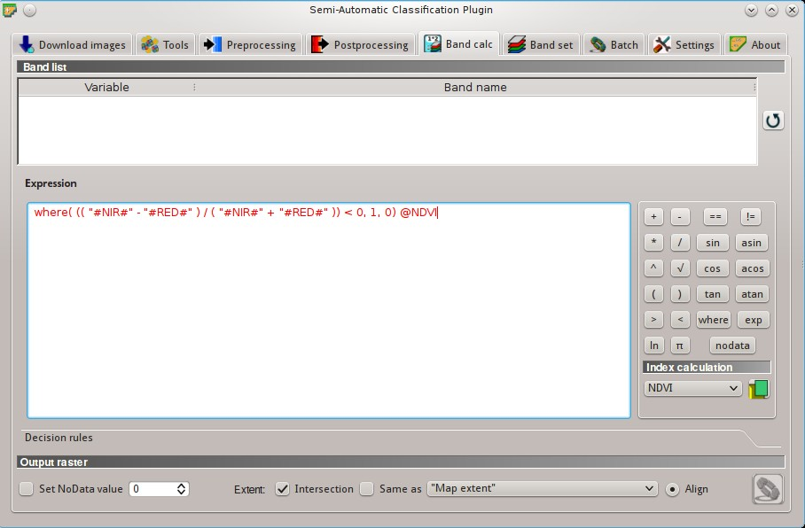
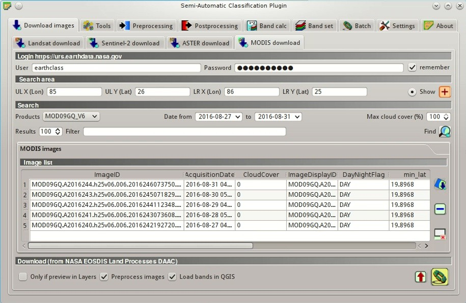
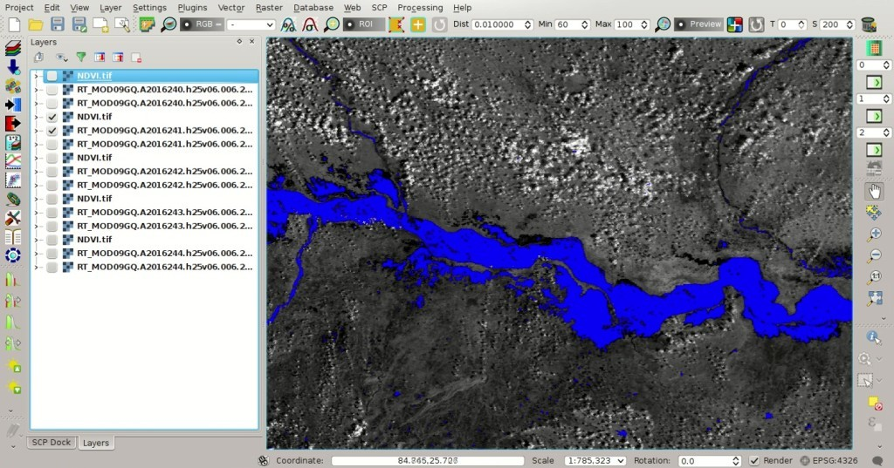
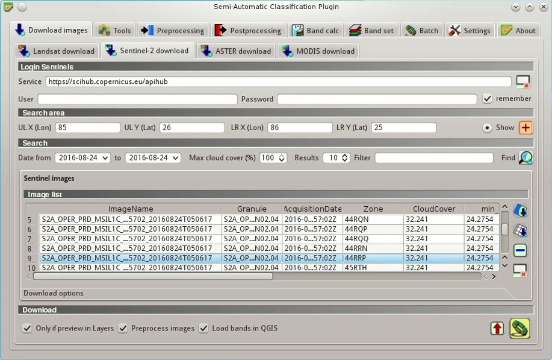
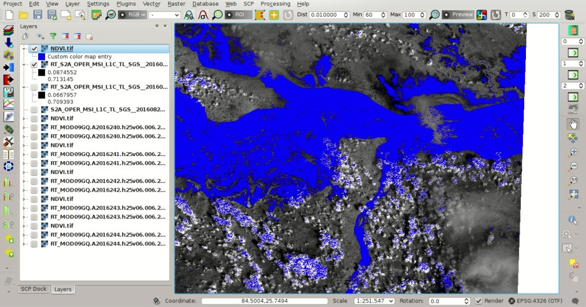

.. _thematic_tutorial_flood_monitoring:

***************************************************************************
Tutorial: Flood Monitoring
***************************************************************************

.. |br| raw:: html

  

.. |input_list| image:: _static/input_list.jpg
	:width: 20pt
	
.. |input_number| image:: _static/input_number.jpg
	:width: 20pt
	
.. |add| image:: _static/semiautomaticclassificationplugin_add.png
	:width: 20pt
	
.. |checkbox| image:: _static/checkbox.png
	:width: 18pt
	
.. |pointer| image:: _static/semiautomaticclassificationplugin_pointer_tool.png
	:width: 20pt
	
.. |radiobutton| image:: _static/radiobutton.png
	:width: 18pt
	
.. |reload| image:: _static/semiautomaticclassificationplugin_reload.png
	:width: 20pt
	
.. |reset| image:: _static/semiautomaticclassificationplugin_reset.png
	:width: 20pt
	
.. |remove| image:: _static/semiautomaticclassificationplugin_remove.png
	:width: 20pt
	
.. |run| image:: _static/semiautomaticclassificationplugin_run.png
	:width: 24pt
	
.. |open_file| image:: _static/semiautomaticclassificationplugin_open_file.png
	:width: 20pt
	
.. |new_file| image:: _static/semiautomaticclassificationplugin_new_file.png
	:width: 20pt
	
.. |open_dir| image:: _static/semiautomaticclassificationplugin_open_dir.png
	:width: 20pt
	
.. |select_all| image:: _static/semiautomaticclassificationplugin_select_all.png
	:width: 20pt
	
.. |move_up| image:: _static/semiautomaticclassificationplugin_move_up.png
	:width: 20pt
	
.. |move_down| image:: _static/semiautomaticclassificationplugin_move_down.png
	:width: 20pt
	
.. |search_images| image:: _static/semiautomaticclassificationplugin_search_images.png
	:width: 20pt

.. |image_preview| image:: _static/semiautomaticclassificationplugin_download_image_preview.png
	:width: 20pt

.. |import| image:: _static/semiautomaticclassificationplugin_import.png
	:width: 20pt
	
.. |export| image:: _static/semiautomaticclassificationplugin_export.png
	:width: 20pt

.. |plus| image:: _static/semiautomaticclassificationplugin_plus.png
	:width: 20pt

.. |order_by_name| image:: _static/semiautomaticclassificationplugin_order_by_name.png
	:width: 20pt

.. |sign_edit_range| image:: _static/semiautomaticclassificationplugin_sign_edit_range.png
	:width: 20pt
	
.. |image_overview| image:: _static/semiautomaticclassificationplugin_download_image_overview.png
	:width: 20pt
	
.. |enter| image:: _static/semiautomaticclassificationplugin_enter.png
	:width: 20pt

.. |download| image:: _static/semiautomaticclassificationplugin_download_arrow.png
	:width: 20pt
	
.. |landsat_download| image:: _static/semiautomaticclassificationplugin_landsat8_download_tool.png
	:width: 20pt

.. |sentinel_download| image:: _static/semiautomaticclassificationplugin_sentinel_download_tool.png
	:width: 20pt
	
.. |tools| image:: _static/semiautomaticclassificationplugin_roi_tool.png
	:width: 20pt
	
.. |roi_multiple| image:: _static/semiautomaticclassificationplugin_roi_multiple.png
	:width: 20pt

.. |import_spectral_library| image:: _static/semiautomaticclassificationplugin_import_spectral_library.png
	:width: 20pt
	
.. |export_spectral_library| image:: _static/semiautomaticclassificationplugin_export_spectral_library.png
	:width: 20pt
	
.. |weight_tool| image:: _static/semiautomaticclassificationplugin_weight_tool.png
	:width: 20pt
	
.. |threshold_tool| image:: _static/semiautomaticclassificationplugin_threshold_tool.png
	:width: 20pt
	
.. |LCS_threshold| image:: _static/semiautomaticclassificationplugin_LCS_threshold_tool.png
	:width: 20pt
	
.. |LCS_threshold_set_tool| image:: _static/semiautomaticclassificationplugin_LCS_threshold_set_tool.png
	:width: 20pt
	
.. |preprocessing| image:: _static/semiautomaticclassificationplugin_class_tool.png
	:width: 20pt
	
.. |landsat_tool| image:: _static/semiautomaticclassificationplugin_landsat8_tool.png
	:width: 20pt
	
.. |sentinel2_tool| image:: _static/semiautomaticclassificationplugin_sentinel_tool.png
	:width: 20pt
	
.. |aster_tool| image:: _static/semiautomaticclassificationplugin_aster_tool.png
	:width: 20pt
	
.. |split_raster| image:: _static/semiautomaticclassificationplugin_split_raster.png
	:width: 20pt
	
.. |clip_tool| image:: _static/semiautomaticclassificationplugin_clip_tool.png
	:width: 20pt
	
.. |pca_tool| image:: _static/semiautomaticclassificationplugin_pca_tool.png
	:width: 20pt
	
.. |vector_to_raster_tool| image:: _static/semiautomaticclassificationplugin_vector_to_raster_tool.png
	:width: 20pt
	
.. |post_process| image:: _static/semiautomaticclassificationplugin_post_process.png
	:width: 20pt
	
.. |accuracy_tool| image:: _static/semiautomaticclassificationplugin_accuracy_tool.png
	:width: 20pt
	
.. |land_cover_change| image:: _static/semiautomaticclassificationplugin_land_cover_change.png
	:width: 20pt
	
.. |report_tool| image:: _static/semiautomaticclassificationplugin_report_tool.png
	:width: 20pt

.. |class_to_vector_tool| image:: _static/semiautomaticclassificationplugin_class_to_vector_tool.png
	:width: 20pt

.. |reclassification_tool| image:: _static/semiautomaticclassificationplugin_reclassification_tool.png
	:width: 20pt

.. |edit_raster| image:: _static/semiautomaticclassificationplugin_edit_raster.png
	:width: 20pt

.. |undo_edit_raster| image:: _static/semiautomaticclassificationplugin_undo_edit_raster.png
	:width: 20pt

.. |classification_sieve| image:: _static/semiautomaticclassificationplugin_classification_sieve.png
	:width: 20pt

.. |classification_erosion| image:: _static/semiautomaticclassificationplugin_classification_erosion.png
	:width: 20pt

.. |classification_dilation| image:: _static/semiautomaticclassificationplugin_classification_dilation.png
	:width: 20pt

.. |bandcalc_tool| image:: _static/semiautomaticclassificationplugin_bandcalc_tool.png
	:width: 20pt
	
.. |batch_tool| image:: _static/semiautomaticclassificationplugin_batch.png
	:width: 20pt

.. |bandset_tool| image:: _static/semiautomaticclassificationplugin_bandset_tool.png
	:width: 20pt
	
.. |settings_tool| image:: _static/semiautomaticclassificationplugin_settings_tool.png
	:width: 20pt
	
.. |manual_ROI| image:: _static/semiautomaticclassificationplugin_manual_ROI.png
	:width: 20pt

.. |save_roi| image:: _static/semiautomaticclassificationplugin_save_roi.png
	:width: 20pt
	
.. |roi_single| image:: _static/semiautomaticclassificationplugin_roi_single.png
	:width: 20pt
	
.. |roi_redo| image:: _static/semiautomaticclassificationplugin_roi_redo.png
	:width: 20pt

.. |preview| image:: _static/semiautomaticclassificationplugin_preview.png
	:width: 20pt
	
.. |preview_redo| image:: _static/semiautomaticclassificationplugin_preview_redo.png
	:width: 20pt
	
.. |delete_signature| image:: _static/semiautomaticclassificationplugin_delete_signature.png
	:width: 20pt

.. |sign_plot| image:: _static/semiautomaticclassificationplugin_sign_tool.png
	:width: 20pt

.. |cumulative_stretch| image:: _static/semiautomaticclassificationplugin_bandset_cumulative_stretch_tool.png
	:width: 20pt

.. |std_dev_stretch| image:: _static/semiautomaticclassificationplugin_bandset_std_dev_stretch_tool.png
	:width: 20pt

.. |calculate_spectral_distances| image:: _static/semiautomaticclassificationplugin_calculate_spectral_distances.png
	:width: 20pt
	
.. |LCS_threshold_ROI_tool| image:: _static/semiautomaticclassificationplugin_LCS_threshold_ROI_tool.png
	:width: 20pt
	
.. contents::
    :depth: 2
    :local:
	
This tutorial describes a method for monitoring floods using :guilabel:`SCP` and the freely available images acquired by MODIS, Landsat, Sentinel-2, and ASTER.

Several services provide global monitoring of floods.
For instance, the near real-time Global Flood Mapping provided by the NASA Goddard's Office of Applied Science.
This services apply a water detection algorithm to MODIS images, as described at `this link <http://oas.gsfc.nasa.gov/floodmap/algorithm.htm>`_ .
You can find an example of produced map `here <http://oas.gsfc.nasa.gov/Products/080E030N/MFM_2016241_080E030N_3D3OT.png>`_ .

Of course, the educational purpose of this tutorial is to monitor flooded areas in a semi-automatic way, exploiting the characteristics of satellite images that can be downloaded with :guilabel:`SCP`.
In particular, :ref:`MODIS_definition` allow for the daily monitoring of floods, and the other satellite images (Landsat, Sentinel-2, and ASTER) have higher spatial resolution allowing for more local studies.

In this tutorial we are going to study the severe flooding occurred in the Ganges in August 2016, caused by monsoon rains.
For more details, please read `this informative page <http://earthobservatory.nasa.gov/IOTD/view.php?id=88729>`_ by NASA Earth Observatory.

Following the video of this tutorial.

.. raw:: html

	<iframe allowfullscreen="" frameborder="0" height="360" src="http://www.youtube.com/embed/7W4IwlvPLbQ?rel=0" width="100%"></iframe>

http://www.youtube.com/watch?v=7W4IwlvPLbQ

.. _tutorial_flood_monitoring_settings:

Preprocessing settings
---------------------------------

Start a new QGIS project.
Before the download of satellite images, it is convenient to define the preprocessing options and calculations that will be applied automatically to downloaded images (read this tutorial `From Image Download to NDVI Calculation in One Move <https://fromgistors.blogspot.com/2016/11/from-image-download-to-ndvi-calculation.html>`_ ).
We are going to calculate a water mask based on NDVI (Normalized Difference Vegetation Index).
In fact, water has generally negative NDVI values, therefore we are going to set an NDVI threshold to create a water mask (there are also other spectral indices related to water identification, but for simplicity NDVI is used in this tutorial).

Open the tab :ref:`band_set_tab` clicking the button |bandset_tool| in the :ref:`SCP_menu`, or the :ref:`toolbar_tools`, or the :ref:`SCP_dock`.
Check |checkbox| :guilabel:`Band calc expression`, which is the link to the tool :ref:`band_calc_tab`.
	
.. figure:: _static/tutorial_flood_monitoring/tutorial_flood_monitoring_1_1.jpg
	:align: center
	
	:guilabel:`Band set settings`
	
Now we can define the expression used for calculation based on the :guilabel:`Band set`.
Open the tab |bandcalc_tool| :ref:`band_calc_tab`, and enter the following conditional expression::

	where( (( "#NIR#" - "#RED#" ) / ( "#NIR#" + "#RED#" )) < 0, 1, 0) @NDVI
	 
This expression calculates the NDVI and set the value 1 if NDVI is lower than 0, and set value 0 otherwise.
The final part ``NDVI`` after ``@`` is the name of the output raster.

	**TIP** : after ``@`` use the variable ``#BANDSET#`` to automatically set an output name based on the name of the first band in the :ref:`band_set_tab`

	
	:guilabel:`Band calc expression`
	
The text color is red because the tab :ref:`band_set_tab` is still empty.
However, the calculation is automatically performed after image download and preprocessing.

.. _tutorial_flood_monitoring_MODIS:

Daily Monitoring With MODIS Data
---------------------------------

We can now search the images.
In this tutorial, we are monitoring a flood occurred in the Ganges river in August 2016.

Open the tab :ref:`download_tab` clicking the button |download| in the :ref:`SCP_menu`, or the :ref:`toolbar_tools`, or the :ref:`SCP_dock`.
Select the tab :ref:`MODIS_download_tab` and define the search area.

	**TIP** : In general it is possible to define the area coordinates clicking the button |pointer| and drawing a rectangle in the map.
	
In :ref:`search_area_MODIS` enter the coordinates of our study area:

* :guilabel:`UL X (Lon)`: 85
* :guilabel:`UL Y (Lat)`: 26
* :guilabel:`LR X (Lon)`: 86
* :guilabel:`LR Y (Lat)`: 25

	**Tip**: plugins such as `QuickMapServices <http://plugins.qgis.org/plugins/quick_map_services/>`_ or `OpenStreetMap <http://www.openstreetmap.org>`_) can be used to display a reference map and identify the study area.

In :ref:`search_MODIS` set the dates (of course we could extend the date range):

* :guilabel:`Date from`: 2016-08-27
* :guilabel:`to`: 2016-08-31

We are going to use the product MOD09GQ that provides daily reflectance at 250m spatial resolution from Terra MODIS.

Now click the button :guilabel:`Find` |search_images| and after a few seconds the images will be listed in the ``Image list``.

	
	:guilabel:`MODIS search`

We can download and process all these images.
Uncheck the option |checkbox| :guilabel:`Only if preview in Layers` and click the button |run| to download all the images listed in the ``Image list``.

After the download and the calculation, the bands and the water mask for every image are loaded in the map.
We can apply a style to these masks to represent the value 1.

	
	:guilabel:`MODIS water masks`
	
Of course, we can see that these masks are affected by clouds and cloud shadows.
Also, the threshold for water can be changed according to the study area, because NDVI values of water can be slightly positive.
However, this is a very rapid way to assess flooded area and the daily evolution.

.. _tutorial_flood_monitoring_sentinel:

Water Mask Using Sentinel-2
-----------------------------------------------

We can repeat the download process with Landsat, Sentinel-2, and ASTER images.
These images have very high spatial resolutions, allowing for the identification of water at large scale.
However, the temporal resolution and the cloud cover reduce the number of available images.

In this case Landsat images are very cloudy, therefore in this tutorial we are going to use a Sentinel-2.
In particular, we are going to download the Sentinel-2 image ``S2A_OPER_MSI_L1C_TL_SGS__20160824T101945_A006122_T44RRP`` acquired on 24/08/2016.

In :ref:`area_coordinates_Sentinel` enter the coordinates of our study area:

* :guilabel:`UL X (Lon)`: 85
* :guilabel:`UL Y (Lat)`: 26
* :guilabel:`LR X (Lon)`: 86
* :guilabel:`LR Y (Lat)`: 25

In :ref:`search_Sentinel` enter the dates:

* :guilabel:`Date from`: 2016-08-24
* :guilabel:`to`: 2016-08-24

	
	:guilabel:`Search Sentinel-2 image`
	
After clicking the button :guilabel:`Find` |search_images| the images are listed in the ``Image list``.
Now click the button |run| to download the image (in particular the zone 44RRP) and the water mask will be calculated because of the expression in :ref:`band_calc_tab` (please read this tutorial :ref:`tutorial_2_data_download` for the details about selecting bands for download).

	
	:guilabel:`Water mask using Sentinel-2 image`
	
We can appreciate the higher spatial resolution of this mask, but we should also consider that Sentinel-2 temporal resolution is lower than MODIS.

To improve the identification of water, we could perform a land cover classification (for instance read :ref:`basic_tutorial_2`), or we could use the tool :ref:`edit_raster_tab` to manually refine the classification removing the errors caused by clouds and cloud shadows.
It is worth mentioning that SAR data such as `Sentinel-1 <https://sentinel.esa.int/web/sentinel/missions/sentinel-1>`_ is useful for flood monitoring.

For more tutorials and information about flood monitoring, data and tools, you can see `this webminar by NASA ARSET <http://arset.gsfc.nasa.gov/disasters/webinars/advfloodwebinar>`_ .
